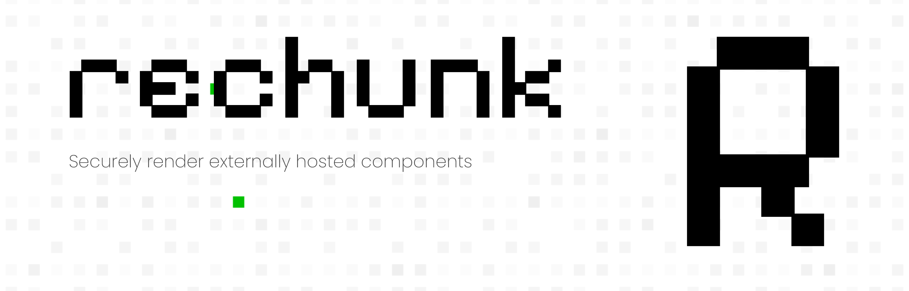

# ReChunk

<picture>
  
</picture>

<h2 align="center">Render Externally Hosted Components with React Native</h2>

## Features

- **🚀 Remote Components**: Effortlessly render externally bundled components within your React Native application. Whether your components reside on remote servers or cloud platforms, rechunk seamlessly integrates them into your project, enabling dynamic and versatile UI experiences.
- **🌎 Host Agnostic**: Enjoy unparalleled flexibility in hosting your components with rechunk. Whether it's on your own servers, cloud providers, or third-party platforms, rechunk remains agnostic to hosting environments.
- **🔒 Secure**: Prioritize security with rechunk's robust digital signature verification mechanism. Every component rendered through rechunk undergoes stringent validation, ensuring that only trusted and verified components are integrated into your application.

## Getting Started

Go to the [Quick Start](https://crherman7.github.io/rechunk/) to get started.

## Contribution

Please read the [Contributing Guide](./CONTRIBUTING.md) and let's build ReChunk together.

If you have any questions, you can open an issue to communicate with us.

### Code of Conduct

Please check [Code of Conduct](./CODE_OF_CONDUCT.md) for more details.

### License

ReChunk is licensed under the [MIT License](./LICENSE.md).

### TODO

- [x] React Native Library
- [x] CLI Library
- [x] Example App
- [x] Server
- [x] Database
- [x] Docker
- [x] API HTTPExceptions
- [x] Finalize rechunk.json
- [ ] CLI Statuses
- [ ] Cleanup db queries / mutations
- [ ] Documentation
