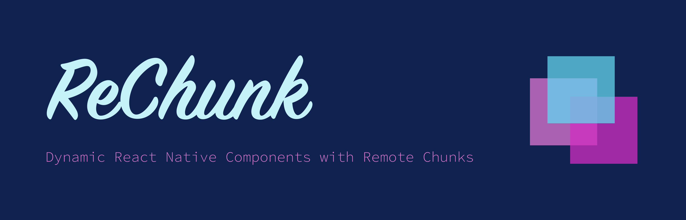

# ReChunk

<picture>
  
</picture>

<h2 align="center">External Hosted Components with Remote Chunks</h2>

## Features

- **🚀 Remote Components**: Ea aliqua est labore labore est mollit ipsum est minim ullamco non. Id id exercitation duis do sint laboris. Nostrud aute ex excepteur est voluptate voluptate fugiat eiusmod ullamco nulla ipsum veniam Lorem sit. Veniam ullamco occaecat ex culpa laborum commodo et.
- **🎨 Custom Hosting**: Fugiat velit deserunt reprehenderit pariatur. Aliquip sunt minim exercitation ad ipsum veniam eiusmod culpa ipsum. Ad commodo pariatur reprehenderit anim aute do nulla amet ut qui mollit eu cillum tempor.
- **🔒 Security First**: Lorem sit deserunt adipisicing laborum occaecat pariatur non excepteur. Magna anim magna sint pariatur esse excepteur. Commodo ullamco eiusmod aliquip id.

## Getting Started

Go to the [Quick Start](https://rechunk.dev/) to get started.

## Contribution

Please read the [contributing guide](./CONTRIBUTING.md) and let's build Flagship Code together.

If you have any questions, you can open an issue to communicate with us.

### Code of Conduct

Please check [Code of Conduct](./CODE_OF_CONDUCT.md) for more details.

### License

ReChunk is licensed under the [MIT License](./LICENSE).
