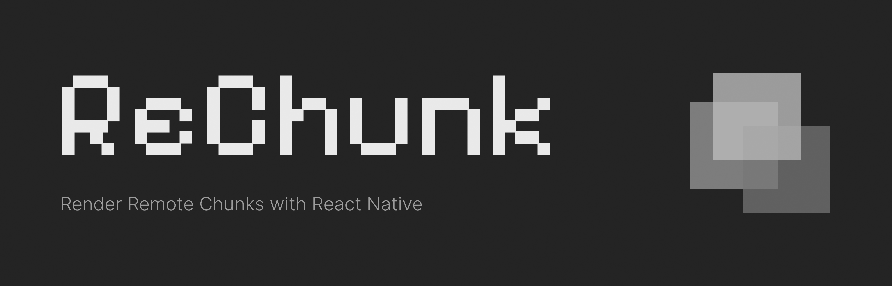

# ReChunk

<picture>
  
</picture>

<h2 align="center">Render Externally Hosted Components with React Native</h2>

## Features

- **🚀 Remote Components**: Aliqua nulla voluptate voluptate ex officia eu occaecat aute culpa culpa.
- **🌎 Host Agnostic**: Est irure voluptate voluptate aliquip enim aute.
- **🔒 Security First**: Commodo pariatur ex nulla et consequat cillum dolore occaecat veniam amet eu minim esse.

## Getting Started

Go to the [Quick Start](https://rechunk.dev/) to get started.

## Contribution

Please read the [contributing guide](./CONTRIBUTING.md) and let's build Flagship Code together.

If you have any questions, you can open an issue to communicate with us.

### Code of Conduct

Please check [Code of Conduct](./CODE_OF_CONDUCT.md) for more details.

### License

ReChunk is licensed under the [MIT License](./LICENSE).
